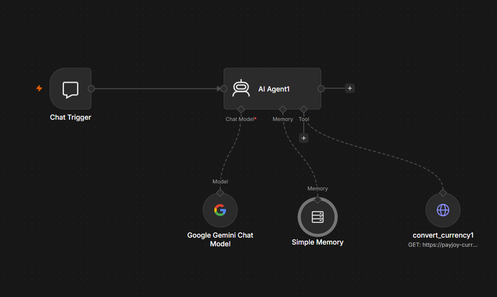

# PayJoy Currency Conversion — Technical Assessment

End-to-end automation that answers one of PayJoy's most common customer questions:

> *"I bought my phone for $200 USD. How much is it in my local currency?"*

The solution has three components: a **REST API** (Python/FastAPI), an **AI-powered chatbot** (n8n + Google Gemini), and a **branded web chat demo** — all deployed and live.

## Live Demo

| Component | URL |
|-----------|-----|
| Web chat demo (talk to the bot) | https://ctroya2899.github.io/payjoy-currency-converter/demo/ |
| API — interactive docs (Swagger) | https://payjoy-currency-converter.onrender.com/docs |
| API — example request | https://payjoy-currency-converter.onrender.com/convert?amount=200&currency=BRL |

> **Note:** the API runs on Render's free tier, which puts the service to sleep after ~15 minutes of inactivity. The first request may take 30–60 seconds while the container wakes up; subsequent requests respond in under a second.

## Architecture


Request path: **Web chat** (GitHub Pages, `@n8n/chat` widget) → **n8n Cloud AI Agent** (Google Gemini interprets natural language and calls the API as a tool — never guesses rates) → **REST API** (FastAPI on Render, `GET /convert`) → **ExchangeRate API** (live rates, cached 5 min).

The AI layer is fully decoupled from the business layer: the model only handles conversation, while every rate comes from the API. Swapping Gemini for another model, or adding a new channel (WhatsApp, IVR), requires no changes to the API.

## Component 1 — REST API

### Endpoint

```
GET /convert?amount=200&currency=BRL
```

```json
{
  "amount_usd": 200.0,
  "currency": "BRL",
  "converted": 1045.80,
  "rate": 5.229
}
```

There is also a `GET /health` endpoint used for uptime checks.

### Error handling

| Scenario | Status | Response |
|----------|--------|----------|
| Missing or invalid parameters (amount ≤ 0, currency ≠ 3 letters) | `422` | Validation detail from FastAPI |
| Unsupported currency code | `400` | `{"detail": "Currency 'XXX' is not supported"}` |
| ExchangeRate API down or timing out | `503` | `{"detail": "Exchange rate provider is unavailable"}` |

### Run it locally

Requirements: Python 3.11+

```bash
# 1. Clone and enter the project
git clone https://github.com/ctroya2899/payjoy-currency-converter.git
cd payjoy-currency-converter

# 2. Create and activate a virtual environment
python -m venv .venv
.venv\Scripts\activate        # Windows
source .venv/bin/activate     # macOS / Linux

# 3. Install dependencies
pip install -r requirements.txt

# 4. Configure environment variables (see below)
copy .env.example .env        # Windows
cp .env.example .env          # macOS / Linux

# 5. Start the API
uvicorn app.main:app --reload
```

The API is now available at `http://127.0.0.1:8000` (interactive docs at `/docs`).

### Environment variables (.env)

Secrets are **never hardcoded** — configuration is loaded from a `.env` file via `pydantic-settings`. Copy `.env.example` to `.env` and fill in your key:

```
EXCHANGE_RATE_API_KEY=your_api_key_here
EXCHANGE_RATE_BASE_URL=https://v6.exchangerate-api.com/v6
```

To get a free API key: sign up at [exchangerate-api.com](https://www.exchangerate-api.com) (free tier, 1,500 requests/month, no credit card). The `.env` file is git-ignored; in production (Render) the same variables are set through the dashboard.

### Run the tests

```bash
pytest -v
```

Tests cover the happy path, currency normalization (`brl` → `BRL`), validation errors (422), unsupported currency (400), and provider failure (503). The external API is mocked, so tests run offline and deterministically.

## Component 2 — Chatbot Flow

Built with **n8n** (chosen over Landbot — see technical choices) in two versions, both exported as JSON in [`docs/n8n-workflow-versions/`](docs/n8n-workflow-versions/):

- **v1 — deterministic flow** (`payjoy-converter-bot-v1.json`): parses "200 BRL"-style input with a Code node, calls the API, and formats the reply. Simple, cheap, predictable.
- **v2 — AI Agent** (`payjoy-converter-bot-v2.json`): a Google Gemini agent with the API registered as an HTTP tool. Understands natural language ("How much is 200 dollars in Brazilian reais?") and conversation memory. **The live demo runs v2.**

The v2 workflow in n8n:



The Chat Trigger receives the message, the AI Agent (Gemini) interprets it and calls `convert_currency` — an HTTP Request tool pointing to the deployed API — then writes the reply. Simple Memory keeps the conversation context. To reproduce it, import the JSON into any n8n instance and attach your own Gemini credential (credentials are never exported).

The agent's system prompt enforces that **every rate must come from the API tool** — the model is forbidden from answering with rates from its own knowledge. If the API is unavailable, the bot says so instead of inventing a number.

### Conversation examples

The designed conversation flow (happy path):


Real conversations from the live bot:

> **User:** How much is 150 dollars in Mexican pesos?
> **Bot:** $150 USD equals approximately $2,636.82 MXN (rate: 17.5788).

Error handled gracefully (unsupported currency):

> **User:** How much is 100 dollars in galactic credits?
> **Bot:** I'm sorry, but I cannot convert to 'galactic credits' as it is not a supported currency. Please provide a valid ISO 4217 currency code (e.g., BRL, MXN, COP, ZAR).

The error-path design mockup is in [`docs/bot conversation sad.png`](docs/bot%20conversation%20sad.png).

## Component 3 — Technical Choices

**Python + FastAPI.** Async support fits an I/O-bound service (the endpoint spends most of its time waiting on the external API), Pydantic gives input validation for free, and Swagger docs are auto-generated. It is also the stack I can defend line by line.

**Layered structure.** Small codebase, but with real separation of concerns — each file has one job, which keeps it testable and easy to extend:

```
app/
  config.py           # settings from env vars (pydantic-settings, no hardcoded secrets)
  models.py           # response contracts (Pydantic)
  exchange_client.py  # external API call, timeout, in-memory cache, custom errors
  service.py          # business logic (normalize, convert, round)
  routes.py           # HTTP layer: endpoints + error → status code translation
  main.py             # app entrypoint, CORS
tests/                # pytest suite with mocked external API
docs/                 # n8n workflow exports, web demo, screenshots
```

**In-memory cache (5 min TTL).** Exchange rates don't change second to second. Caching protects the 1,500 req/month free-tier quota and makes repeat conversions ~instant. For multiple instances I would move it to Redis.

**n8n instead of Landbot.** The role works with low-code automation tools daily, and n8n is the one I have real experience with. It also allowed me to go one step further than a scripted flow: an AI agent that uses the API as a tool, closer to how modern CX bots are built.

**Honest scope note.** The brief's customer asks for a *monthly installment*, but the specified API contract only converts a total amount. I built exactly what the spec defines, and I flag the gap: adding an optional `months` parameter (with PayJoy's financing rules) would be a natural next iteration.

## What I Would Improve With More Time

- **Installment calculation** — extend the API with financing terms (months, interest) to fully answer the customer's real question.
- **WhatsApp channel** — n8n supports WhatsApp Business / Twilio triggers; the same agent workflow could serve WhatsApp with no API changes (a draft is in `docs/n8n-workflow-versions/payjoy-converter-whatsapp-draft.json`).
- **Always-on hosting** — remove Render cold starts (30–60s first request) with a paid instance or a scheduled keep-alive ping.
- **Redis cache + rate limiting** — shared cache across instances and protection against abuse of the public endpoint.
- **CI/CD** — GitHub Actions running the test suite on every PR, blocking merges on failure.
- **Structured logging & alerting** — request IDs, latency percentiles per layer, and alerts on error-rate spikes.
- **Response streaming** — stream the agent's answer to the chat widget to improve perceived latency (~10s end-to-end today, mostly LLM inference).

## How I Would Measure Success in Production

**Containment / deflection rate** — % of currency questions resolved by the bot without a human agent. This is the metric that justifies the automation.

**Technical health:**
- API error rate by type (4xx vs 5xx) and p95 latency per layer (API <1s, end-to-end bot <10s)
- External provider failures (503s) — spikes mean the fallback messaging is being exercised
- Cache hit ratio — protects the provider quota

**Customer experience:**
- CSAT on bot conversations vs. human-handled ones
- Fallback rate — how often users hit the "unsupported currency / try again" paths
- Drop-off point analysis — where users abandon the conversation

**Business impact:**
- Agent minutes saved per month (bot resolutions × average handle time)
- Cost per resolution: bot (API + LLM tokens) vs. human agent

## Transparency: AI Tools Used

- **Cursor (AI assistant)** — my pair programmer throughout the project: reviewing my code, explaining concepts, and helping debug (e.g., a CORS misconfiguration and a deprecated Gemini model name). I wrote the code myself, iterating with the assistant, and I understand every line submitted — the layered structure, the error-handling strategy, and the agent prompt design are decisions I can defend in detail.
- **Napkin AI** — used to create the visual assets in [`docs/`](docs/): the solution architecture diagram and the bot conversation mockups used for planning the flow before building it.
